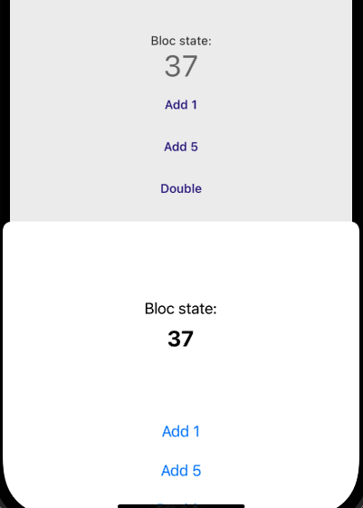

# flutter_reference

An example of a Flutter project with native bloc interop, to be used as a reference.

Set up this project as you would normally; run with `flutter run`.

When creating or editing a file that has a corresponding source file generated by freezed, regenerate with `flutter pub run build_runner build`.

## Architecture

This reference architecture uses a layered model, with a domain layer that's accessible from anywhere. It features a method channel bridge and classes for accessing Flutter blocs from native code.

Most of the code in this app is merely provided as an example, and the architectural decisions are thoroughly explained in the code to enable you to make appropriate choices for your project.

The main idea of this structure is the same as in any layered application:

- Widgets (view layer) can only use blocs (business layer) but not repositories or services directly;
- Blocs (business layer) expose their functionality to widgets and use services from the data layer to run business logic;
- The data layer is only ever used by blocs, but not by widgets directly.
- Any component can interact with corresponding implementation in native code. This structure does not depend on any kind of structure in the native side.

Check the following pages for details on each part of the architecture:

- [View layer](doc/view_layer.md)
- [Business layer](doc/business_layer.md)
- [Data layer](doc/data_layer.md)
- [Domain](doc/domain.md)
- [Bridge](doc/bridge.md)
- [Recommended libraries](doc/recommended_libs.md)

## Demos

When you start up the app, you'll see a menu with a list of pages. They're examples that demonstrate different techniques and good practices.

I recommend having the app open as you read this section.

### Form

Page: **Simple list with form**

Description: Simple list page with a form for adding new items.

This loads a list of mocked products, to demonstrate the simplest type of bloc. Look for "Product" classes in the code, such as `product_form.dart` and `product_bloc.dart`.

The UI in this and in other pages is very basic because the code is mainly meant to demonstrate programming techniques and architectural patterns.

Among the techniques shown in this page:

- The event for fetching new items in the list has a parameter to determine if we should fetch again even if the items are already loaded. This lets us skip a refetch when not necessary, such as when the user is opening the page for the second time.
- The fields in the form have validation logic, but the validation errors only appear after the user has finished interacting with the input for the first time. We also only enable the submit button after conditions have been met for all fields.
- A monetary input (in `monetary_input.dart`) demonstrates custom input logic. In this case, we use a regex to only allow text that is a valid monetary value, but you can use this idea to restrict an input to any custom format.
- Classes for the bloc state use the Freezed package for convenience.

### Nested bloc state

Page: **List with details request**

Description: A bloc for a list, where each item in the list has a details request.

Sometimes a list request only returns partial items, and each one needs a second request for getting details or some other information. This page demonstrates how a bloc can store additional information about each item.

We call this a nested state because the details for each object are also implemented with the same structure as a bloc state (with failure, sucess and loading states for each item).

In this page, we also use the same strategy as the simple list for avoiding refetches. When some data already exists in the bloc and doesn't need to be fetched again, it doesn't cause a new request. Do this whenever you can to avoid loading transitions in your app.

See the "buyer" classes for the code, such as the `buyer_bloc.dart` file.

### Interop Bloc

Page: **Interop bloc**

Description: Using a bloc in Dart from native code, with events and state listeners.

The counter page in this demo app contains an example of a bloc that can be used even in native code. The `CounterBloc` in `counter_bloc.dart` gets that ability by extending our custom `InteropBloc`. It needs to provide a few methods for converting messages, and we also need the corresponding bloc adapters in native code (look for the `CounterBlocAdapter` classes in Kotlin and Swift). The logic for using the method channel in native code is also abstracted in superclasses, and by extending them, we can send events to the Dart bloc and listen to the Dart bloc's state changes. Everything works in real time without needing manual refreshes anywhere, and without needing to duplicate the state in native code.

All of these custom classes can be simply copied over to your code. If you need this, be sure to check out our documentation page on the [Bridge](doc/bridge.md) to learn more.

We don't go as far as implementing native versions of bloc builders. This example app doesn't even use reactive frameworks for the native code (jetpack compose or swift ui), in order to provide only the most basic example. Feel free to improve on this, and feel free to contribute to this project with native bloc builders and listeners if you want to.

### Postal code search

Page: **Search by postal code**

Description: Using a client to a third-party API.

This page uses a real request to Viacep to search a Brazilian CEP postal code.

Classes: `address_lookup_bloc.dart` -> `address_repository.dart` -> `viacep_client.dart`

The code is technically simple, and this is primarily an architectural reference. A few important points:

- The code uses Viacep, and the request is implemented in a separate client. The AddressRepository (note: not _ViacepRepository_, since the repository hides the detail of where data comes from) uses DTOs to completely decouple Viacep from everything else. If we wanted to change the Viacep API to something else, we would write a new client and change the repository to use the new client, without changing the repository's method signatures.
- The domain entity for an Address is completely independent of whatever the Viacep API returns. Because we don't control the Viacep API, we use DTOs to represent its classes. Conversion is encapsulated in the AddressRepository. Notice how the repository always produces domain objects, and hides any implementation details of _how_ it obtains those objects.

### Automatic events

Page: **Conway's game of life**

Description: A bloc that can send its own events.

(Conway's game of life is a cellular automaton. It's not important to be familiar with it, because it's being used here only as an example and any other code that needs automatic events would also work.)

In this example, the bloc emits its own events when the program is autoplaying. This demonstrates that it doesn't matter where events come from. Events don't necessarily need to be emitted from the widget tree.

This also shows how a bloc can continue to work in the background, even when none of the pages that use it are loaded. You can leave the game of life autoplaying as you navigate through other pages. This shows how the lifetime of blocs is not restricted by the lifetime of any widget. This fact can also be a weakness, because the app may slow down if you forget many blocs running code in the background.

The `life_bloc.dart` and other "life" files contain the relevant code. This page also shows how you can extract business logic to another file if the rules are complicated. In this case, Conway's game of life represents any complicated business logic that you may have in the bloc, and they're extracted to a separate file named `life_rules.dart` that exists in the same directory and is only used by the corresponding bloc. From the outside, it's as if all the logic was in the bloc itself.

Among other things, this also shows some differences to traditional object-oriented programming, such as the fact that we don't put business logic in the domain. See the files for more details.

### Lifecycle listener

Page: **App lifecycle listener**

Description: Detect when the app goes into the background.

The page is a very simple demo of how an `app_lifecycle_provider.dart` can be used to detect the app going into the background, such as when the user goes to the phone's home page. This lets you run custom code in that kind of sitation. The UI shows counters to tell exactly when each event happens (resumed, inactive, paused and detached). Be sure to test in both Android and iOS.

### Local Storage

Page: **Settings with local storage**

Description: Using the phone's local storage to persist local information. Plus, settings with different key names in Android and iOS.

This reference architecture describes _clients_ for remote APIs and _services_ for local APIs. This page has a service (`local_storage_service.dart`) for storing simple data locally. It also has some useful examples for error types. This demonstrates how a _service_ can encapsulate a local API that would probably end up in a Utils folder in a less structured project (avoid Utils folder and classes).

The SettingsBloc (at `settings_bloc.dart`) contains a sample implementation of a settings bloc. The strategy that we adopt is to write asynchously and consider that saving a setting's value is a low-risk operation without grave consequences in case of error, so we give feedback for the user's action immediately and then write the updated value to local storage.

Secondarily, this page also contains some layout examples for a settings page separated by sections.

### Card layout

Page: **Card text layout demo**

Description: Using widget constrains to write responsive cards.

Widget-only demos are rare in this project because we focus on demonstrating a Flutter architecture, but this really is just a few widgets without blocs or services. It shows a card component (`demo_card.dart`) that displays a title and a few different types of text inside. The card uses constraints to always use space in the most efficient way, and is also resilient to extremely large font sizes (you can change font sizes in the card's file or in the phone's OS, and the widget should not break either way).

### Random Page

Page: **Random Page**

Description: Item that sends the user to a random page.

One of the simplest items in the menu, this item corresponds to a route that doesn't have a fixed destination, but is calculated during runtime at `router.dart`.

This is an example of simple logic that runs during navigation. The redirect demos show other strategies that you should consider when you need to run code during navigation, especially if you need to run more complicated logic when following a route.

### Redirect demos

Pages: **Life with modal redirect** / **Life with one-time redirect** / **Life with added route**

Description: Three different ways of implementing redirection logic with GoRoute.

All three menu items lead to the same page as the **Conways's game of life** item, but with some redirection logic. **Life with modal redirect** opens a modal page on top of the original destination, **Life with one-time redirect** changes the destination once only, and **Life with added route** adds an additional route on top of the original destination only when the life simulation is not running.

See the `redirect_pages.dart` page for a more detailed explanation of how each strategy works, and their advantages and disadvantages.

### Map

Page: Map with stuff over it

Description: Custom Flutter widgets rendering over a Google maps map.

You'll need to configure a Google Maps key to fully use this demo, but it should be understandable even without one.

This page has our own Widgets organized on top of a map. The widgets are capable of interacting with the map using a map controller. In `map.dart`, we declare our own `MapController` that adapts Google Maps' controller, letting us possibly change the implementation without completely rewriting the code.

### Inter-bloc communication

Page: Login and inter-bloc communication

Description: Example of a login bloc that can affect logic in other blocs.

In this page, the lists show different items depending on who is logged in. Also, logging out automatically clears the information in the other blocs.

Blocs always try to be as decoupled from each other as possible, but sometimes a business rule needs information that only exists in another bloc. A very common example is the login bloc, which contains information that's relevant to many parts of the app.

Communication between blocs actually happens in two different ways, and each has a different solution:

- "Type-A" communication is for when a bloc needs to notify another bloc to cause some kind of processing. For example, clearing lists or other information when the user logs out. In this case, a bloc needs to _affect something in a different bloc_.
- "Type-B" communication is for when a bloc needs to access some information in another bloc to make a decision. For example, calculating a request parameter that's determined by information in another bloc. In this case, a bloc needs to _access information from a different bloc_.

These two cases are different kinds of dependency and are solved in different ways in this reference architecture. Type-A communication is solved with the `GlobalEventAware` mixin, which lets blocs send events to other blocs, and Type-B communication is solved with the `AppDataService` class, which lets blocs share information that would typically be contained only in the bloc's state.

- `GlobalEventAware` is a mixin that can be added to any bloc. By using this mixin, a bloc gets access to a global event stream and is able to send and receive events to communicate with all other blocs that also have the `GlobalEventAware` mixin. In this code, `LoginBloc` uses this to send a logout event to `Bloc1` and `Bloc2`. All three of them have the `GlobalEventAware` mixin. Events are sent with `addGlobal(...)` and are handled with `onGlobal(...)`.
- `AppDataService` is a service that works like a global variable, and because of that, it's very dangerous and should be used with utmost care! This service contains a minimal amount of information that is relevant to business rules in many different blocs. In this code, `Bloc1` and `Bloc2` access information about the user who is currently logged in, and that information is written and updated by the `LoginBloc`.

Be very careful with communication between blocs, and avoid it whenever it's not absolutely necessary. Always check if there are other ways of solving your problem, such as with listeners in the Widget tree, or using local storage. Using (and abusing) global events makes it harder to write unit tests.
