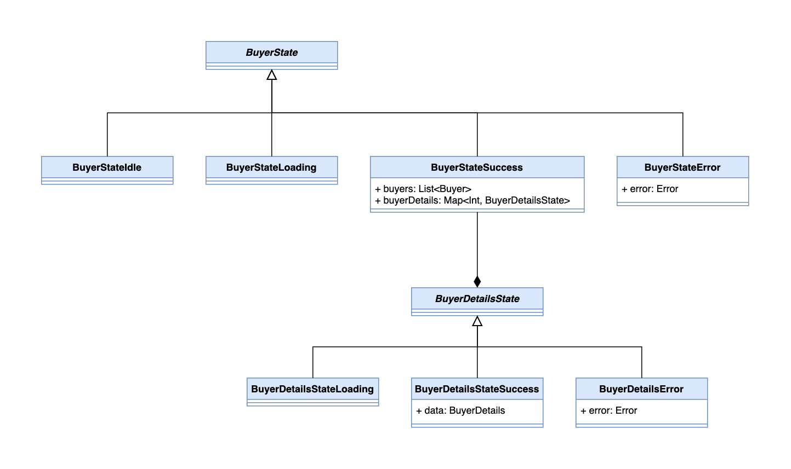

# Business Layer

Our business layer is primarily populated by Flutter blocs (see the [flutter_bloc](https://pub.dev/packages/flutter_bloc) package). Because other pages in this documentation and elsewhere already expand on this topic sufficiently, this page is meant primarily for explaining the business layer structuraly.

## Simple Blocs

When a bloc is relatively simple and comfortably fits in a single file, it's expected that all business logic related to that bloc can be found in the bloc's class. In this case it's sufficient to write the bloc just like in the simplest examples found in tutorials.

### What belongs in each layer

A very common concern is deciding where each piece of information belongs; The main guiding principle is that _business rules (and thus the blocs) are independent of view logic, and should continue working the same regardless of any changes in the view layer_.

In other words, each bloc merely exposes its functionality through events and streams, but it does not care how the data in those streams is used or who emits events, much less about the visual likeness of the widgets.

---

**Let's make a thought experiment**. Imagine an app with dozens of different features but everything is placed in a single enormous page; every label, button, input field and list exists in a single page all at the same time. Putting aside the clear absurdity of this hypothetic app, I invite you to imagine how this page would connect to the blocs.

The key realization is that the blocs themselves would be built exactly the same as in a more reasonable app, with each part of the UI connecting to the relevant bloc.

The same would be true if the UI was a simple text-based terminal, or if the user interacted with the blocs using chatbots. A more realistic example would be imagining a different navigation structure in your app, which shouldn't require reworking your blocs.

From this though experiment, we can deduce a few key principles:

- Information regarding the currently displayed page or the currently displayed state on the screen (such as the current step of a multi-step form) does not belong in the bloc, because it's part of the UI's efforts to present information in a friendly manner. Generally, all navigation is either manual (initiated by the user doing a certain action to go to a page), or automatic (fired by a bloc listener in the UI in response to a specific state change).
- Avoid as much as possible sending parameters directly to another page. Navigation parameters are exclusively for UI logic.
  > **Example**: When a page is displaying a list, and pressing on an item leads the user to another page showing details, it's permissible to send the id of the item that was pressed. This is because the item that's being shown is presentation logic (remember our throught experiment, where the list and the details could very well have been implemented in one page without changing the way the bloc works). However, it would not be acceptable to send information to the details page that is not present in the bloc.
- Events represent things that happen in the app in an abstract way; they don't say that a certain button was pressed, but rather that a certain use case has begun. In the same way, the state never contains information for specific widgets (like a "message for a modal"), but rather abstract data that the UI decides how to display to the user (e.g. an "error message" that the UI decides to display in a modal).

## Nested States

A relatively common use case for blocs is storing the state of multiple objects, such as a list of objects that are individually fetched and can individually change state. If this sounds too abstract, check the `buyer_bloc.dart` file: it contains a simple request that fetches a list, but then also contains a map of details for each individual item, fetched with a different request.

The typical implementation of a bloc state involves an abstract superclass and multiple concrete classes, each with their own properties. Each concrete class itself represents some meaningful information. The idea of nested states is realizing that this structure is not limited to just the state object; parts of the state can also use it to represent states of individual pieces of data.

The requests associated with the nested states are done the same way as with the main state, by using events. You simply need an additional event that tells the bloc to fetch a specific nested state.

Using a map for nested states allows the bloc to remember all the individual pieces of data to avoid redundant requests.

## Use cases and services

Complex logic can easily overpopulate a bloc with too much code. Though one might be tempted to move excessive code to a separate utility class or to a repository, when the code consists of business rules, it really does belong in the bloc.

When organizing code, complicated logic may be extracted from a bloc into mainly two places: use cases and services.

- Use cases are separate files in the same directory as the bloc, used only by that bloc (and not others); this reference architecture does not enforce a specific format, and the implementation is very free to change. Functionally, the bloc behaves as if all the code in the use cases existed in the bloc's class.
  > For example, a "login" use case may be a function that receives strings for username and password, and make a sequence of requests to multiple servers, ultimately returning an object describing whether the login succeeded, and if so, whether certain actions are necessary (like redirects). Putting all that logic in the bloc's class would make it unwieldy to read and maintain, so it's a better idea to place it in a separate file.
- Services in the data layer are for reusable logic that is not directly related to a bloc. For example, formatting strings or dates according to some known standard can be put in a service. Typically, these services will not contain rules that are directly related to the app's business; if you need reusable business logic for multiple blocs, consider merging blocs.

## Folder structure

- **(src)**
  - **business**
    - **business/infra**: Directory for all infrastructure, like the InteropBloc.
    - **business/{feature}**: Directory for a specific feature, containing blocs and any helper classes.
      - **business/{feature}/{feature}\_bloc.dart**: File for the bloc itself, its events and the state.
      - **business/{feature}/{usecases}.dart**: Any number of files with any number of functions for containing business rules that are too complex to comfortably fit in the main bloc's file. What exactly is contained in these files is left to the programmer's discretion; this reference architecture does not provide a standardized way of executing large amounts of business rules, as that is typically not required in an app.
