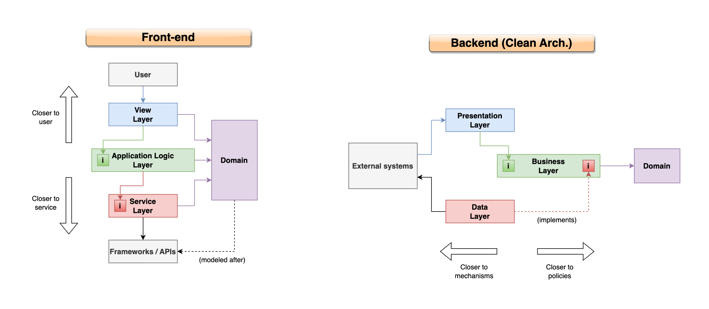
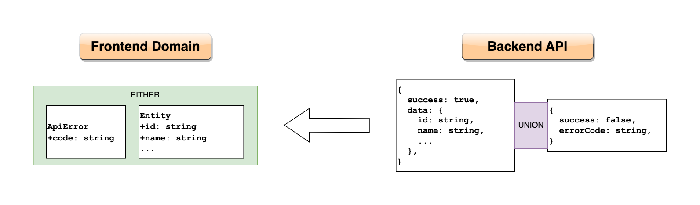

# Domain

The domain folder isn't a "layer", but rather a part of the application's language and protocols.

In certain architectures, like MVVM, the domain is explicitly part of the business logic. Not so here, where all our domain entities are strictly data classes. This is very common in this sort of reactive architecture that incorporates elements of functional programming, as opposed to more traditional object-oriented approaches where the classes contain behavior.

The domain layer is unique in that it's accessible from anywhere in the application. In the context of clean architecture (and other similar architectures), this resembles the _core_ in the sense that the domain can be referenced by other layers but cannot itself reference anything else in the application, and likewise its design must not be affected by the design of other layers directly.

However, unlike in clean architecture where the placement of all interfaces in the business layer lets it be the only point of contact with the domain, here we allow all layers of the application to reference the domain directly. We don't consider the frontend's middle layer to be "close" to, or the same as the domain because it consists of application logic with different responsibilities as a backend's business logic layer.

Additionally, the domain in a frontend application isn't absolutely in the middle of everything; rather, the entities are modeled in accordance to the backend's API. Keep in mind that minor changes should be made sometimes to better serve the application's needs.

## Entities

Entities represent concepts in the business domain. Unlike in Java (but like in Python and Kotlin, and who knows in C#), it is acceptable and actually an encouraged practice to place multiple classes in one file, as long as they are logically related.

An entity in the app will often be a copy of an enitity in the backend's api, as seen in the image above, it is sometimes sensible to make adaptations to the API's return types to better serve the frontend. Possible mappings between the app's domain and other APIs can be handled in the clients using DTOs.

## Error

This reference architecture recommends a superclass for all errors throwable in the application. Its purpose is to minimize unknown errors, and encourage everything to always be handled. Note that regardless of having such a superclass or not, the bloc must always handle any errors in everything it does, such that errors are never exposed to the UI through exceptions, but through the state.

Additionally, the view layer is never expected to throw errors. The view layer only ever shows errors from the state.

> When logic in the view layer, for example a simple form's logic, needs to show an error, it does so by simply setting error messages and not by throwing new instances of errors.

### Language and Error Messages

The most correct way to handle error messages is to not include human language in the entities at all, and leave it to the view layer to translate error codes into readable error messages. That's because more generally, the view layer is responsible for all user interaction.

However, in this example architecture we allow for readable error messages in the domain, which is a shortcut for applications that don't plan to add internationalization support, or that already receive readable error messages from the API for legacy reasons.

## Freezed

It is recommended to use the freezed package in all domain entities, to automatically obtain utility methods such as `copyWith(...)`. The serialization methods are especially useful for when native interop through the bridge is required.

## Folder structure

- **(src)**
  - **domain**:
    - **domain/entity**
    - **domain/error**
    - **domain/constant**: Directory for any constants in the app, such as urls (but don't include API secrets in your app); may include message strings for apps with internationalization.
